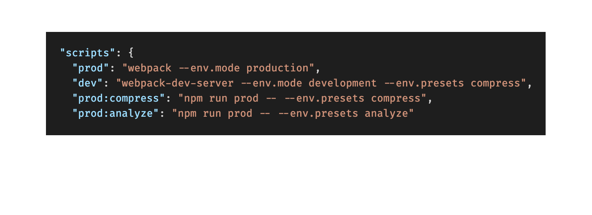

# Webpack Config

Webpack initial configuration, with best practices in mind.

---

For an initial configuration using React, check: [react's branch](https://github.com/andreslemusm/webpack-config/tree/react)

---

# Get Started

This webpack configuration is splitted in the two most important parts of front end development; your development and production environment.

## Create your custom dev environment

1.  Go to `/buildUtils/webpack.development.js`
2.  Add whatever loaders, plugins you wish to make your webpack dev server load as fast as possible.

## Create your custom prod environment

1.  Go to `/buildUtils/webpack.production.js`
2.  Add your custom configuration in order to make your bundle as performance as possible.

## Abstract common configs

1.  Erase common configuration between production and development.
2.  Place erase configurations in `/webpack.config.js`.

## Add custom presets

1.  Create your custom presets under `/buildUtils/presets/` following this notation (without the braces):

> `webpack.[presetName].js`

2. Go to `/package.json` and create your preset script:

